- [최종 관통 프로젝트](#최종-관통-프로젝트)
  
    + [팀원 정보 및 업무 분담 내역](#팀원-정보-및-업무-분담-내역)
    
    + [목표 서비스 구현](#목표-서비스-구현)
    
    + [데이터베이스 모델링 (ERD)](#데이터베이스-모델링-erd)
    
    + [필수 기능에 대한 설명](#필수-기능에-대한-설명)
    
    + [실제 설계, 구현 과정 (날짜 별 과정) 및 느낀점](#실제-설계-구현-과정-날짜-별-과정-및-느낀점)
      
        * [진행 과정](#진행-과정)
          + [5월 19일 [설계 단계]](#5월-19일-설계-단계-)
          + [5월 20일 [구현 초기 단계]](#5월-20일-구현-초기-단계-)
          + [5월 23일 [구현 단계] (주말 느낀점 포함.)](#5월-23일-구현-단계-주말-느낀점-포함)
          + [5월 24일 [구현 단계]](#5월-24일-구현-단계)
          + [5월 25일 [css 단계]](#5월-25일-css-단계)
          + [5월 26일 [css 및 마무리 단계]](#5월-26일-css-및-마무리-단계)
        
    + [마치며.. ](#마치며)
      
      - [PS : 추가하고 싶은 기능](#ps-추가하고-싶은-기능)
      - [기타 :](#기타-)
      
      

# 최종 관통 프로젝트


### 팀원 정보 및 업무 분담 내역

* 팀 : 동지팥죽
* 팀원 : 김동희, 김지영
* 업무 분담 : 
  * 김동희 : **BACKEND** & FRONTEND & README작성 & 발표자료 준비
  * 김지영 : **FRONTEND** & BACKEND & CSS 작업 & 발표자료 준비


### 목표 서비스 구현 

* **최종 목표**
  *  영화 데이터 기반 추천 서비스 구성
  * 영화 추천 알고리즘 구성
  
    *  밸런스 게임을 통한 영화 추천 알고리즘
    *  최신영화, 인기영화, 영화 랜덤 추천
  * 커뮤니티 서비스 구성
  
    *  영화 리뷰 커뮤니티
    *  밸런스 게임 커뮤니티
  *  HTML, CSS, JavaScript, Vue.js, Django, REST API, Database 등을 활용한 실제 서비스 설계
  *  서비스 관리 및 유지보수
  *  반응형 웹 사이트 구현
  *  서버는 Django REST API를 활용하고, 프론트엔드 프레임워크는 Vue.js를 활용하여 분리
  *  **사용자 친화적 페이지를 만들자.**
  * **페이지의 방향을 확실히 잡자.**


### 데이터베이스 모델링 (ERD)

* 초기 설정 ERD
  * 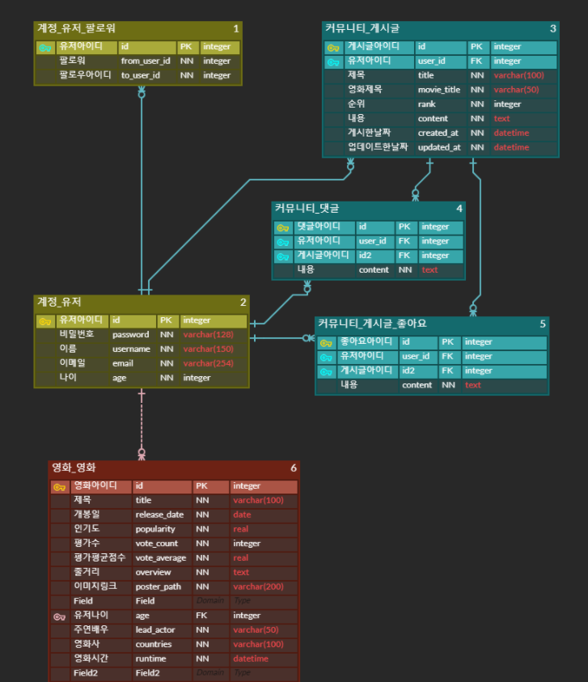
* 최종 ERD
  * 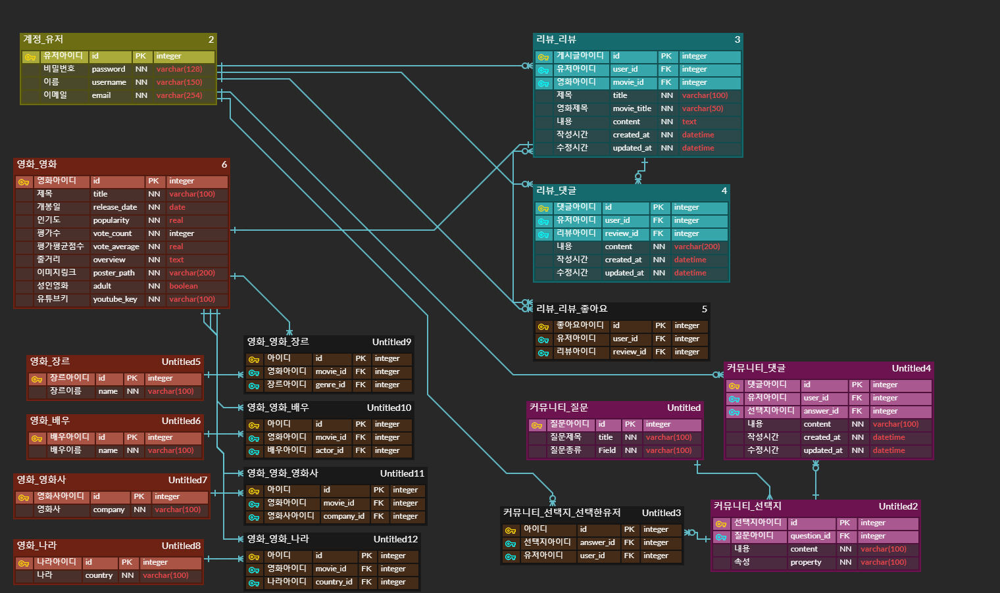

* ERD 기본 지식
  * 관계선의 종류
    * 실선: 식별관계
      * 부모테이블의 PK가 자식테이블의 FK/PK가 되는 경우
      * 부모가 있어야 자식이 생기는 경우

    * 점선: 비식별관계
      * 부모테이블의 PK가 자식테이블의 일반속성이 되는 경우
      * 부모가 없어도 자식이 생기는 경우

  * 기호의 종류
    * ｜: 1개 / 실선은(dash) ‘1'을 나타낸다.
    * ∈: 여러개 / 까마귀 발(crow’s foot or Many)은 ‘다수' 혹은 '그 이상'을 나타낸다.
    * ○: 0개 / 고리(ring or Optional)은 ‘0'을 나타낸다.


### 필수 기능에 대한 설명

**추천 알고리즘**

* 흔히 말하는 **벨런스 게임을 활용**하여 선택한 결과에 따라 사용자에게 **영화를 추천**해주는 기능

* 밸런스 질문에 따른 **결과의 수치에 대한 토론**을 할 수 있는 커뮤니티(작성 / 수정/ 삭제) 기능

* 영화 상세 페이지에서 **다양한 상세정보**와 함께 **유튜브 티저 등 미리보기** 기능 제공

* 영화 상세 페이지 내부 **리뷰 작성 / 수정/ 삭제** 및 리뷰에 대한 **코멘트 작성 / 수정/ 삭제** 기능

* 유저 페이지에서 **자신의 선택 조회** 기능 및 리뷰, 코멘트 등 **작성한 기록을 확인**할 수 있는 기능

* 참고자료 : 

  * [와이어프레임(피그마)](https://www.figma.com/file/WwWeSVqcKYoIW452hgROdy/Untitled?node-id=0%3A1)

    [ERD(erdcloud)](https://www.erdcloud.com/d/zLfuq32hAzXK7iGDq)

    [협업프로그램(트렐로)](https://trello.com/b/doFgtlRu/movieproject01)

    [깃랩](https://lab.ssafy.com/remi1217/the-balance-movie)

  

### 실제 설계, 구현 과정 (날짜 별 과정) 및 느낀점

##### **진행 과정**

###### 5월 19일 [ 설계 단계 ]

* 해야할 일 : 

  * **팀 이름 선정**
  * **아이디어 회의 (필수 기능 포함)**
  * **디자인 회의 (와이어 프레임)**
  * **ERD 작성**
  * **url 설정**
  * **컴포넌트 도식화 설계**

* 한 일 :

  * **팀 이름 선정** : 동지 팥죽

    * 동(희)지(영)
    * 동지는 일 년 중 밤이 가장 길고 낮이 가장 짧은 날을 의미한다. 말 그대로 밤새 프로젝트를 진행할 각오를 담았고, 안 좋은 일을 싸악 없애주는 팥죽을 더했다.

  * **아이디어 회의** : 

    * 흑백논리 / 알고리즘이나 좋아요 등의 결과를 간단히 이분법적으로 선택만 하면 된다는 것을 강조하려 했다.
    * 메인페이지를 아예 랜덤 질문으로 >> 사용자가 선택할 수 있게 해주며 선택 이후 추천된 영화를 띄워준다.
    * 해당 페이지에서 클릭하여 들어간, 디테일 페이지는 영화를 누르면 디테일이 나오게 되며 어사이드로 유튜브 미리보기가 가능하도록 한다. 
    * 그리고, 선택을 하면 유저들이 선택한 수가 책정이 될 수 있도록 하여 결과를 보며 토론까지 할 수 있는 페이지를 만든다. 선택 결과로 요즘 트랜드를 알 수 있다는 느낌도 줄 수 있지 않을까?

  * **디자인 회의 (와이어 프레임)**: 

    * 초기 스토리보드
    * 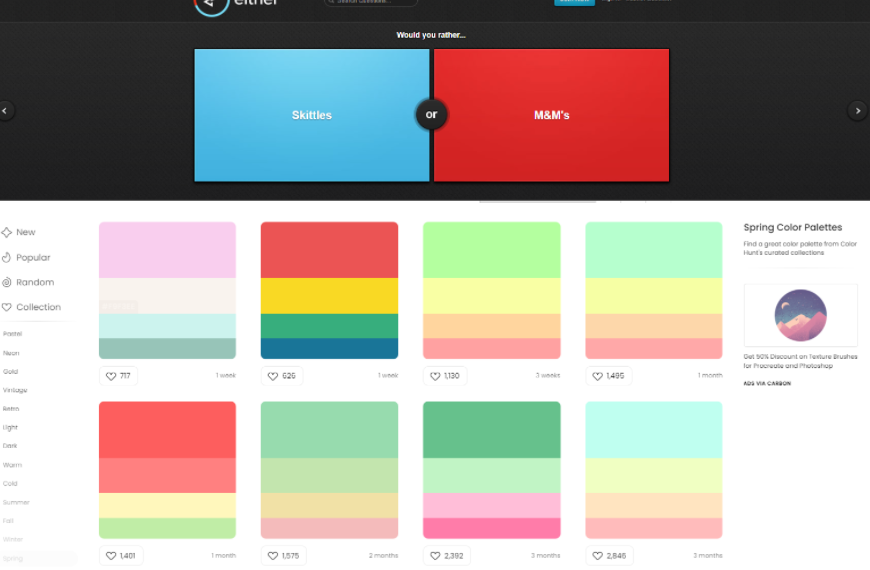
    * figma를 활용한 와이어 프레임 작성
    * [figma 링크](https://www.figma.com/file/WwWeSVqcKYoIW452hgROdy/Untitled?node-id=0%3A1)
    * figma 전체 이미지
    * 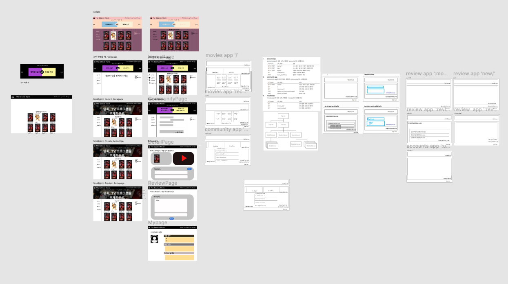

  * **ERD 작성** 

    * 위 ERD 별도 이미지 제공

    * like_users <-> like_movies **M:N**

      user <-> reviews **1:N**

      like_users <-> like_reviews **M:N**

      movie <-> reviews **1:N**

      review <-> comments **1:N**

  * **url 설정**

    1. accounts app

       path: 'accounts/'

       - 'signup/': 회원가입
       - 'login/': 로그인
       - 'logout/': 로그아웃
       - `'profile/<username>/'`: 사용자 프로필

    2. movies app

       path: 'movies/'

       - '/': 메인페이지, 밸런스 게임
       - 'recent/': 최신 영화 조회
       - 'popular/': 인기 영화 조회
       - 'random/': 랜덤 영화 조회
       - 'collection/': 내가 좋아요를 누른 영화 조회
       - `'<int:movie_pk>/'`: 영화 상세 페이지

    3. community app

       path: 'community/'

       - `'<int:question_pk>/'`: user가 선택한 질문들에 대해 다른 user들의 비율 / 댓글 조회

    4. reviews app

       path: 'reviews/'

       - '`<int:movie_pk>/`': 리뷰 작성
       - `'<int:movie_pk>/<int:review_pk>/'`: 리뷰 상세 페이지 (제목, 내용, 영화, 글쓴이, 댓글 등), 수정, 삭제
       - `'<int:movie_pk>/<int:review_pk>/like/'`: 리뷰 좋아요
       - `'<int:movie_pk>/<int:review_pk>/comments/'`: 리뷰 댓글 작성
       - `'<int:movie_pk>/<int:review_pk>/comments/<int:comment_pk>/'`: 리뷰 댓글 수정, 삭제

  * **컴포넌트 도식화 설계**

    * 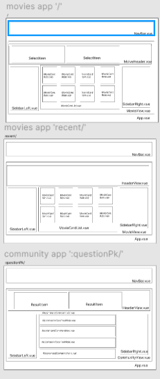
    * 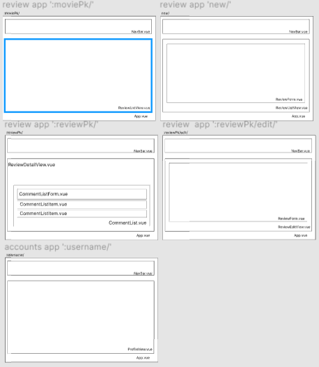

  * **느낀점 (자유 형식)** : 

    * 처음이 질문을 20개 넘게 많이 작성 하였으나, 모두 구현하기에 시간이 부족할 수 있다고 판단하여 같은 종류의 질문 4개로만 구성하여 필수적인 기능을 구현하는 것이 먼저라고 판단하였다. 또한 처음 큰 틀을 빠르게 잡기 위해서 그동안 프로젝트를 진행한 방식으로 페어 프로그래밍을 하였다. 역시 큰 도움이 되었다.
    * 계정 app은 순조롭게 넘어갔으나, 다음 진행 과정부터는 json 데이터 파일이 필요하였고 이를 만들어 줄 필요가 있었으며, django를 활용하여 API로 끌어와 dumpdata로 만들고 싶었지만 어려움이 있었다. 
    * 이번에 설계할 때, 긴 시간 동안 꼼꼼히 작성한 것이 다음 진행과정 계획에 큰 도움이 될 수 밖에 없음을 깨달았고 이는 프로젝트 할 때마다 명심할 것 같다.
    * ERD 작성시 1:M 관계 M:N 관계가 바로 그려지지 않았다. 그리고 해당 필요한 데이터가 적재적소에 사용되기 위한 디테일을 그려내는데 어려움이 있었다.

    

    

###### 5월 20일 [ 구현 초기 단계 ]

* 해야할 일 : 

  * **json 데이터 생성**
  * **models 모델링**
  * **serializer 시리얼라이징**

* 한 일:

  * **json 데이터 생성 :** 

    * ex ) movie.json

    * ```json
      {
          "model": "movies.movie",
          "pk": 482321,
          "fields": {
              "title": "고장난 론",
              "release_date": "2021-10-15",
              "popularity": 302.762,
              "vote_count": 1220,
              "vote_average": 8.1,
              "overview": "최첨단 소셜 AI 로봇 비봇이 모든 아이들의 친구가 되는 세상. 비봇을 갖는 것이 유일한 소원인 소심한 소년 바니에게도 드디어 론이라는 비봇이 생겼다. 그러나 첨단 디지털 기능과 소셜 미디어로 연결된 다른 비봇들과는 달리, 네트워크 접속이 불가능한 고장난 론. 자유분방하고 엉뚱한 론으로 인해 벌어지는 엉망진창, 스릴 넘치는 모험을 함께하며 바니는 진실한 우정이 무엇인지 점점 깨닫게 되는데..",
              "poster_path": "/ljYdrF1faaWbzcrZuQ6BTqfVHcS.jpg",
              "adult": false,
              "youtube_key": "8I8nMtzN05s",
              "genres": [
                  16,
                  35,
                  878,
                  10751
              ],
              "like_users": [],
              "actors": [
                  27105,
                  39187,
                  58225,
                  1029934,
                  1774679
              ],
              "company": [
                  22213,
                  107183,
                  121605,
                  127928,
                  141821
              ],
              "country": [
                  123,
                  124
              ]
          }
      },
      ```

    * ex) community.json

    * ```json
      [
          {
              "model": "community.question",
              "pk": 1,
              "fields": {
                  "title": "보스베이비 vs 컨저링",
                  "field": "genre"
              }
          },
      ```

  * **models 모델링**

    * ex) movie.models

    * ```python
      from operator import mod
      from django.db import models
      from django.contrib.auth import get_user_model
      User = get_user_model()
      
      class Genre(models.Model):
          name = models.CharField(max_length=100)
          def __str__(self):
              return self.name
      
      class Actor(models.Model):    
          name = models.CharField(max_length=100)
          def __str__(self):
              return self.name
      
      class Company(models.Model):
          company = models.CharField(max_length=100)
          def __str__(self):
              return self.company
          
      class Country(models.Model):
          country = models.CharField(max_length=100)
          def __str__(self):
              return self.country
      
      class Movie(models.Model):
          title = models.CharField(max_length=100)
          release_date = models.DateField()
          popularity = models.FloatField()
          vote_count = models.IntegerField()
          vote_average = models.FloatField()
          overview = models.TextField()
          poster_path = models.CharField(max_length=200)
          adult = models.BooleanField()
          youtube_key = models.CharField(max_length=100)
      
          genres = models.ManyToManyField(Genre, related_name='movies')
          like_users = models.ManyToManyField(User, related_name='like_movies')
          actors = models.ManyToManyField(Actor, related_name='movies')
          company = models.ManyToManyField(Company, related_name='movies')
          country = models.ManyToManyField(Country, related_name='movies')
      
      
          def __str__(self):
              return self.title
      
      ```

    * ex) community.models

    * ```python
      from django.db import models
      from django.conf import settings
      
      
      class Question(models.Model):
          title = models.CharField(max_length=100)
          field = models.CharField(max_length=100)
      
          def __str__(self):
              return self.title
      
      
      class Answer(models.Model):
          question = models.ForeignKey(
              Question, on_delete=models.CASCADE, related_name='answer')
          content = models.CharField(max_length=100)
          property = models.CharField(max_length=200)
          select_users = models.ManyToManyField(settings.AUTH_USER_MODEL, related_name='select_answers')
      
          def __str__(self):
              return self.content
      
      class Comment(models.Model):
          user = models.ForeignKey(settings.AUTH_USER_MODEL, on_delete=models.CASCADE, related_name='question_comments')
          answer = models.ForeignKey(Answer, on_delete=models.CASCADE, related_name='comments')
          content = models.CharField(max_length=200)
          created_at = models.DateTimeField(auto_now_add=True)
          updated_at = models.DateTimeField(auto_now=True)
      
      ```

    * 이하 생략 (review.model)

  * **serializer**

    * ex) community.serializer.answer

    * ```python
      from rest_framework import serializers
      from django.contrib.auth import get_user_model
      
      from ..models import Answer, Question, Comment
      from .comment import AnswerCommentSerializer
      
      User = get_user_model()
      
      class QuestionSerializer(serializers.ModelSerializer):
          class AnswerSerializer(serializers.ModelSerializer):
              class AnswerCommentSerializer(serializers.ModelSerializer):
                  class UserSerializer(serializers.ModelSerializer):
                      class Meta:
                          model = User
                          fields = ('pk', 'username')
                  user = UserSerializer(read_only=True)
                  class Meta:
                      model = Comment
                      fields = ('pk', 'user', 'content')
              comments = AnswerCommentSerializer(read_only=True, many=True)
                  
              class Meta:
                  model = Answer
                  fields = '__all__'
          answer = AnswerSerializer(read_only=True, many=True)
          
          class Meta:
              model = Question
              fields = '__all__'
              
      class QuestionListSerializer(serializers.ModelSerializer):
          class Meta:
              model = Question
              fields = ('title',)
      
      
      class AnswerSerializer(serializers.ModelSerializer):
          
          class UserSerializer(serializers.ModelSerializer):
              class Meta:
                  model = User
                  fields = ('pk', 'username')
      
          select_users = UserSerializer(read_only=True, many=True)
          
          class AnswerCommentSerializer(serializers.ModelSerializer):
              class Meta:
                  model = Comment
                  fields = ('pk', 'user', 'content')
          comments = AnswerCommentSerializer(read_only=True, many=True)
          
          class Meta:
              model = Answer
              fields = ('pk', 'content', 'property', 'question', 'select_users', 'comments')
      ```

    * ex) community.serializer.comment

    * ```python
      from rest_framework import serializers
      from django.contrib.auth import get_user_model
      from ..models import Comment
      # from .answer import AnswerSerializer
      
      User = get_user_model()
      
      class AnswerCommentSerializer(serializers.ModelSerializer):
          
          class UserSerializer(serializers.ModelSerializer):
              class Meta:
                  model = User
                  fields = ('pk', 'username')
      
          user = UserSerializer(read_only=True)
          # answer = AnswerSerializer(read_only=True)
      
          class Meta:
              model = Comment
              fields = ('pk', 'user', 'content', 'answer',)
              read_only_fields = ('answer', )
      ```

    * 이하 생략 ( account.serializer / model.serializer / review.serializer) 

  * **느낀점 :** 

    * 오늘 교수님께서 프로젝트에 필요한 협력 도구 등 많은 것을 알려 주셨다. 그 중 figma 나 trello 그리고 erdclude를 사용하며 편리함을 느꼈다.
    * 또한 좋은 말귀..를 들었다.
      1. 삽질 총량의 법칙
      2. 새로운 지식 >> 문제 해결 추론 능력 up
      3. 기억은 안남아도 기록은 남는다.
      4. 모든 것을 공유하고 소통하자. >> 함께 해결 >> 내가 할 수 있는 일에 기여가 목적.

    *  postman을 통해 url을 입력하였을 때, 넘어오는 데이터 값을 확인하며 작업하니 훨씬 시리얼라이징 하기 편리하였다. 

    * json 파일을 만들기 위해서 새로운 django page를 따로 만들어서 구현하였다.

      API로 받아오기 위해 정종윤 교수님께서 많은 가르침을 주셨다.

    * ```python
      from django.http import HttpResponse, JsonResponse
      from django.shortcuts import render
      import requests
      from .models import Genre, Movie, Actor, Company, Country
      
      API_KEY = '비공개'
      GENRE_URL = 'https://api.themoviedb.org/3/genre/movie/list'
      POPULAR_MOVIE_URL = 'https://api.themoviedb.org/3/movie/popular'
           
      #영화 장르
      def genre_data():
          response = requests.get(
              GENRE_URL,
              params={
                  'api_key': API_KEY,
                  'language': 'ko-kr',            
              }
          ).json()
      
          for genre in response.get('genres'):
              Genre.objects.create(
                  id=genre.get('id'),
                  name=genre.get('name')
              )
          return JsonResponse(response)
      
      # youtube 동영상 key
      def get_youtube_key(movie_dict):    
          movie_id = movie_dict.get('id')
          response = requests.get(
              f'https://api.themoviedb.org/3/movie/{movie_id}/videos',
              params={
                  'api_key': API_KEY
              }
          ).json()
          for video in response.get('results'):
              if video.get('site') == 'YouTube':
                  return video.get('key')
          return 'nothing'
      
      # movie에 출연한 배우 정보
      def get_actors(movie):
          movie_id = movie.id
          response = requests.get(
              f'https://api.themoviedb.org/3/movie/{movie_id}/credits',
              params={
                  'api_key': API_KEY,
                  'language': 'ko-kr',
              }
          ).json()
          
          for person in response.get('cast'):
              if person.get('known_for_department') != 'Acting': continue
              actor_id = person.get('id')
              if not Actor.objects.filter(pk=actor_id).exists():
                  actor = Actor.objects.create(
                      id=person.get('id'),
                      name=person.get('name')
                  )
              movie.actors.add(actor_id)
              if movie.actors.count() == 5:
                  break
      #영화 제작 회사        
      def company(movie):
          movie_id = movie.id
          response = requests.get(
              f'https://api.themoviedb.org/3/movie/{movie_id}',
              params={
                  'api_key': API_KEY,
                  'language': 'ko-kr',
              }
          ).json()
          for company in response.get('production_companies'):
              company_id = company.get('id')
              if not Company.objects.filter(pk=company_id).exists():
                
                  comp = Company.objects.create(
                      id=company.get('id'),
                      company=company.get('name')
                  )
              movie.company.add(company_id)
              if movie.company.count() == 5:
                  break
              
      #영화 해당 국가        
      def country(movie):
          movie_id = movie.id
          response = requests.get(
              f'https://api.themoviedb.org/3/movie/{movie_id}',
              params={
                  'api_key': API_KEY,
                  'language': 'ko-kr',
              }
          ).json()
          for country in response.get('production_countries'):        
              country_name = Country.objects.create(
                  country=country.get('iso_3166_1')
              )
              movie.country.add(country_name.pk)
          
      
      def movie_data(page=1):
          response = requests.get(
              POPULAR_MOVIE_URL,
              params={
                  'api_key': API_KEY,
                  'language': 'ko-kr',     
                  'page': page,       
              }
          ).json()
      
          for movie_dict in response.get('results'):
              if not movie_dict.get('release_date'): continue   # 없는 필드 skip
              # 유투브 key 조회
              youtube_key = get_youtube_key(movie_dict)
              
              movie = Movie.objects.create(
                  id=movie_dict.get('id'),
                  title=movie_dict.get('title'),
                  release_date=movie_dict.get('release_date'),
                  popularity=movie_dict.get('popularity'),
                  vote_count=movie_dict.get('vote_count'),
                  vote_average=movie_dict.get('vote_average'),
                  overview=movie_dict.get('overview'),
                  poster_path=movie_dict.get('poster_path'),   
                  adult=movie_dict.get('adult'),
                  youtube_key=youtube_key         
              )
              for genre_id in movie_dict.get('genre_ids', []):
                  movie.genres.add(genre_id)
      
              # 배우들 저장
              get_actors(movie)
              company(movie)
              country(movie)
              print('>>>', movie.title, '==>', movie.youtube_key)
              
      def tmdb_data(request):
          Genre.objects.all().delete()
          Actor.objects.all().delete()
          Movie.objects.all().delete()
          Company.objects.all().delete()
          Country.objects.all().delete()
          
          genre_data()
          for i in range(1, 6):
              movie_data(i)
          return HttpResponse("OK >>>>>>>>>>>>>>>>>>>>>> ")
      
      
      
      ```


###### 5월 23일 [구현 단계] (주말 느낀점 포함.)

* 해야할 일 : 

  * **VUE 작업** (mainpage, profile page, detail page) 각 기능 포함

* 한 일:

  * 동희

    * **front**

      - fetchPopularMovies, fetchRandomMovies, fetchCollectionMovies 함수 작성
      - popularmovie, collectionmovie 페이지 구현
      - sidebar 추가
      - review delete, update 구현
      - review comment 구현

    * **back**

      - profileSerializer 작성

    * 느낀점

      * 모든 페이지에서 movies 마다 movie의 like_count 를 가져올 수 있었는데, 

        이것을 like 버튼을 눌렀을 시에 바로 늘려주는 작업을 하다가, 

        like_count 를 눌렀을 때의 함수로 데이터를 변동시켜 주고 싶었는데 새로 랜더링이 되지 않아 

        부가적인 기능이라고 판단하여 우선 잠시 미루었다. 

        

        profile에 많은 data가 떠주길 바랐으나, serializer를 입력하지 않아, 다시 재수정이 필요했었다.

        지금껏 작성한 serializer 를 상속하여 원하는 데이터를 뽑아냈다.

        ```python
        profile.serializer
        
        class ProfileSerializer(serializers.ModelSerializer):
            class MovieSerializer(serializers.ModelSerializer):
                like_count = serializers.IntegerField(source='like_users.count', read_only=True)
                class Meta:
                    model = Movie
                    fields = ('id','title', 'like_count', 'poster_path')
        
            like_movies = MovieSerializer(many=True)
            
            class ReviewSerializer(serializers.ModelSerializer):
                class Meta:
                    model = Review
                    exclude = ['user']
                    read_only_fields = ('movie',)
                    
            reviews = ReviewSerializer(many=True)
            
            class CommentSerializer(serializers.ModelSerializer):
                review = ReviewSerializer()
                class Meta:
                    model = Comment
                    fields = ('pk', 'content', 'review')            
                
            comments = CommentSerializer(many=True, read_only=True)    
            
            class AnswerSerializer(serializers.ModelSerializer):
                class Meta:
                    model = Answer
                    fields = ('pk', 'content', 'property', 'question', 'comments')
        
            select_answers = AnswerSerializer(many=True)
            
            class AnswerCommentSerializer(serializers.ModelSerializer):
                class Meta:
                    model = Comment
                    fields = ('pk', 'content', 'answer',)
                    read_only_fields = ('answer', )
            question_comments = AnswerCommentSerializer(many=True)
        
            class Meta:
                model = get_user_model()
                fields = ('pk', 'username', 'email', 'like_movies','reviews','comments','select_answers','question_comments' )
        
        ```

        review 를 남기는 글에 원하는 movieid가 들어가야 했고, 이를 router 로 연동시켜서 보내주는 작업을 했다. 업데이트 및 삭제 기능이 처음에 원할하지 않았지만, console.log의 활용으로 추적하여 데이터를 정확히 지정하여 기능을 완료했다.

        주말에 추천 알고리즘을 views파일에 작성했다.

        우선 장르 속성값을 가지면, 그 장르가 해당 movie 속성에 존재하면 매칭해서 시리얼라이징 해주고, 또한 url 요청이 POST로 들어오면 그 대답을 한 user의 수나 정보를 파악하기 위해서 저장해주는 함수도 추가했다.(with 지영)

        ```python
        @api_view(['GET','POST'])
        def movie_property(request, answer_id):
        
            answer = Answer.objects.get(id=answer_id)
            user = request.user
        
            def property_movie_list():
                movies = Movie.objects.annotate(
                        like_count=Count('like_users', distinct=True)
                    ).all() # 배열
                select_movies = []
                for movie in movies:
                    if movie.genres.filter(id=answer.property).exists():
                        select_movies.append(movie)
                
                serializer = MovieListSerializer(select_movies, many=True)
                return Response(serializer.data)
            def save_answer():
                if not answer.select_users.filter(pk=user.pk).exists():
                    answer.select_users.add(user)
                serializer = AnswerSerializer(answer)
                return Response(serializer.data)
        
                
            if request.method == 'GET':
                return property_movie_list()
            elif request.method == 'POST':
                return save_answer()
        ```

        

        

  - 지영

    - **front**

      - movie 좋아요 기능 구현
      - movie detail 페이지 제작
- **back**
  
  - movie serializer 오류 수정
      - collection movie views함수 구현
    - **구현과정**
- collectionmovies 함수에서 user모델로 movie를 가져올때 like_count를 annotate로 구현할 수없어서 문제가 발생하였다. collectionSerializers 안에 movieSerializer를 재정의하여 문제해결하였다.
        - 이와 같이 front 작업을 하다보니 back에 문제가 있어서 다시 되돌아가서 back을 수정해줘야 하는 이슈가 종종 있었다. 기획 과정에서 모델링을 좀 더 확실히 해야겠다고 느낄 수 있었다.
- 밸런스 게임의 질문지를 다음으로 넘겼을 때 이전에 선택했던 질문지의 영화가 그대로 남아있어서 화살표를 누르면 movies 데이터가 초기화되는 set_init 함수를 만들었다.
      - 영화 카드를 누르면 디테일 페이지로 이동하도록 링크를 연결하였다.
- 원래 django의 url에서 review의 수정, 조회, 삭제를 할 때 관련 영화의 Id도 url로 함께 받아주도록 했었는데 create를 제외하고는 movieId가 url로 굳이 넘겨줘도 되지 않는 정보라 생각하여 movieId를 받지 않도록 수정함.


###### 5월 24일 [구현 단계] 

* 해야할 일 : 

  * **VUE 작업** (community page 작업하기 / mypage 만들기/) 각 기능 포함
  * **CSS 작업 시작**

* 한 일:

  * 동희

    * **back**

      - community 페이지 구현

    * **느낀점:**

      * 선택한 수를 가지고 합치는 작업이 필요했다. 계산하는 함수를 자바스크립트로 넣어 methods Actions 함수로 버튼 클릭시 계산할 수 있도록 했다.

      * 계산할 때, Array 배열의 length 속성으로 0값을 뽑아내면 NAN이 걸려서 함수 안에 일부러 0으로 만들어 주었다.

      * ```javascript
        fetchTotal({ commit, dispatch }, total) {
            if (total !== 0) {
                commit('SET_TOTAL', total)
            } else {
                commit('SET_TOTAL', 0)
            }
            dispatch('onResultOpened')
        },
            onResultOpened({ commit }) {
                commit('ON_RESULT_OPENED', this.getters.onresult)
            },
        ```

      * answer 1, answer 2 로 해당 axios 요청받은 데이터를 state, getter에 fetch할 수 있도록 만들어줘야 해서  key값으로 홀 짝수를 통해 구분하여 함수를 만들어 해결했다.

        * ```javascript
          createAnswerComment({ commit, getters }, { answerId, content }) {
              const comment = { content }
              axios({
                  url: drf.community.comments(answerId),
                  method: 'post',
                  data: comment,
                  headers: getters.authHeader,
              })
                  .then(res => {
                  if (answerId % 2 === 1) {
                      commit('SET_ANSWER1_COMMENTS', res.data)
                  } else {
                      commit('SET_ANSWER2_COMMENTS', res.data)
                  }
              })
                  .catch(err => console.error(err.response))
          },
          ```

      * community 페이지에서는 질문과 그 질문에 전체 득표수 결과 그리고 대답들과 매칭될 답변을 생성/ 삭제/ 수정하는 기능이 모두 들어가야 했기에 앞서 설계된 구조를 보며 사용할 수 있는 함수들을 재활용하며 하루내내 완성할 수 있었다.

      * 함수하나를 잘 만들어 놓으면 재활용하는 일이 생겨 일을 훨씬 수월하게 할 수 있었다.

  * 지영

    * **front**

      * 메인페이지, movie detail 페이지 css 작성

    * **구현과정**
  
      * 메인페이지 게임 선택지를 가운데 정렬을 주었는데 문제번호에 따라 화살표가 나타났다 나타나지 않았다해서 가운데 카드가 왔다갔다하는 현상이 있었다. 이를 해결하기 위해 화살표를 position relative를 주고자 하였다. => 브라우저 화면을 축소시켰을 때 문제 발생, 해결필요
      * 좋아요 눌렀을 때와 누르지 않았을 때 버튼의 모양이 다르도록 조건문을 걸어주고자 하였다. like_users에 request.user가 포함되었는지를 확인해야 하는데 in, indexOf, includes 등을 사용해보았다.
  
      * in은 인식이 되지 않았다.
            * indexOf를 썼더니 -1에서 true 0에서 false라 원하는 대로 표현되지 않았다.
  
      * includes가 가장 적합한 것으로 선정되었다.
          * 모든 영화 리스트를 하나의 데이터 movies에 저장해두었기 때문에 다른 페이지에 갔다가 홈으로 돌아왔을 때 그 영화 리스트들이 화면에 남아있는 현상이 있었다. 이를 해결하기 위해  router-link에 click이벤트를 걸었으나 이벤트가 발생하지 않았고 router.beforeEach를 이용하여 router를 이동할 때 항상 movies를 초기화하는 SET_INIT을 발생하도록 구현하였다.
      * 유튜브 트레일러를 보여줄 때 width를 꽉차게하고 그에 맞게 비율을 맞춰 height를 주고싶었다. 그래서 부모에 area라는 클래스를 주고 width가 100%일 때 16:9의 비율로 padding-bottom을 56.25%를 준 다음 iframe에 width, height를 100%씩 주었더니 구현할 수 있었다.

##### 5월 25일 [css 단계]

- 해야할 일:

  - movie review, community, profile 페이지 css 작성
  - 영화를 삭제/추가/생성할 수 있는 관리자용 페이지 구현

- 한 일:

  1. 메인페이지 css

     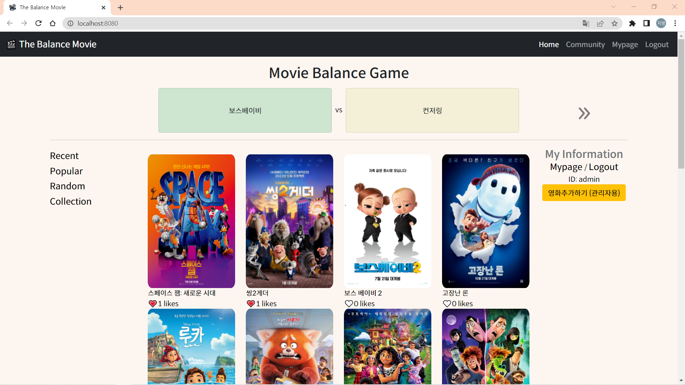

  2. 영화 디테일 페이지 css

     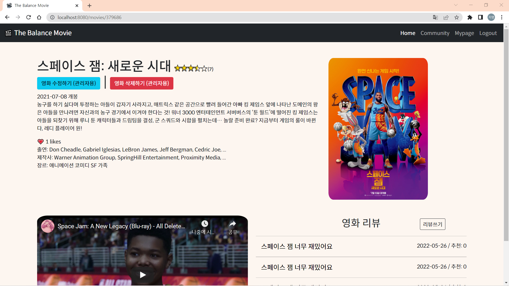

     - 평점을 별로 표현하는 코드

       ```html
       <span class="star-ratings">
         <span
               class="star-ratings-fill space-x-2 text-lg"
               :style="{ width: ratingToPercent + '%' }"
               >
             <span>★</span><span>★</span><span>★</span><span>★</span><span>★</span>
         </span>
         <span class="star-ratings-base space-x-2 text-lg">
             <span>★</span><span>★</span><span>★</span><span>★</span><span>★</span>
         </span>
       </span>
       ```

       ```css
       .star-ratings {
         font-size: 20px;
         color: #aaa9a9;
         position: relative;
         unicode-bidi: bidi-override;
         width: max-content;
         -webkit-text-fill-color: transparent; /* Will override color (regardless of order) */
         -webkit-text-stroke-width: 1.3px;
         -webkit-text-stroke-color: #2b2a29;
       }
       .star-ratings-fill {
         font-size: 20px;
         color: #fff58c;
         padding: 0;
         position: absolute;
         z-index: 1;
         display: flex;
         top: 0;
         left: 0;
         overflow: hidden;
         -webkit-text-fill-color: gold;
       }
       .star-ratings-base {
         z-index: 0;
         padding: 0;
       }
       ```

  3. 리뷰 디테일 페이지

     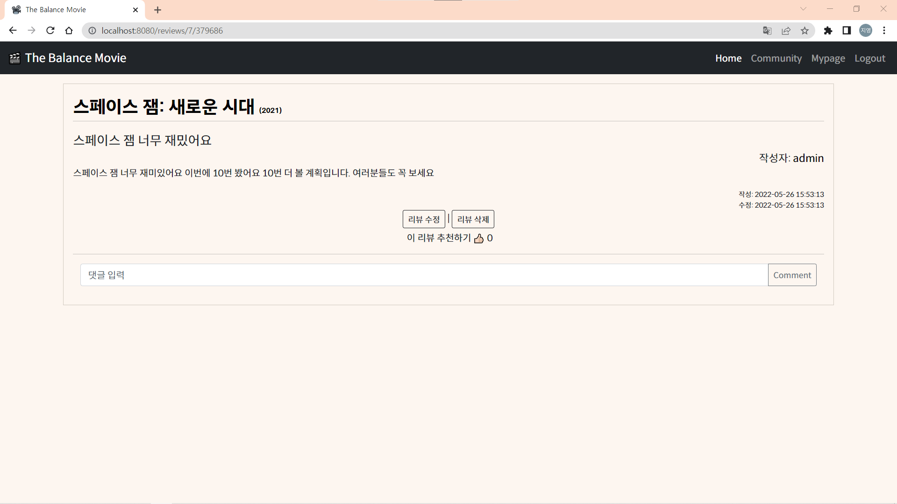

  4. 커뮤니티 페이지

     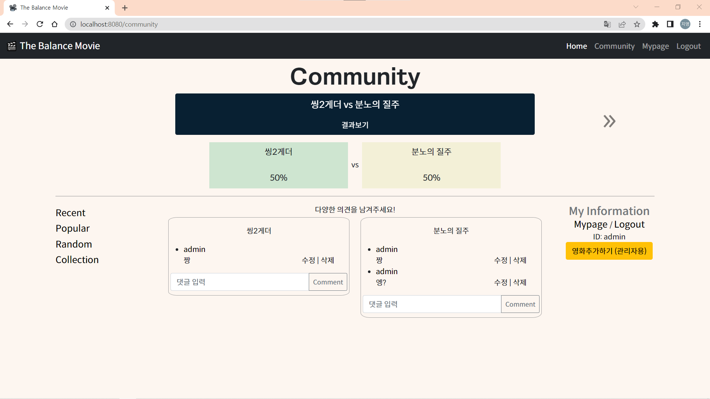

  5. 프로필 페이지

     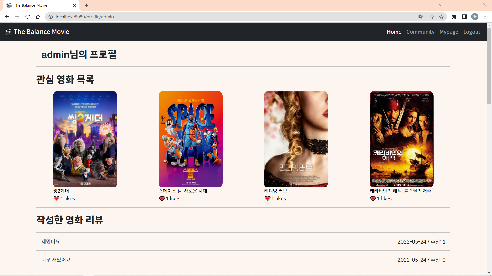

     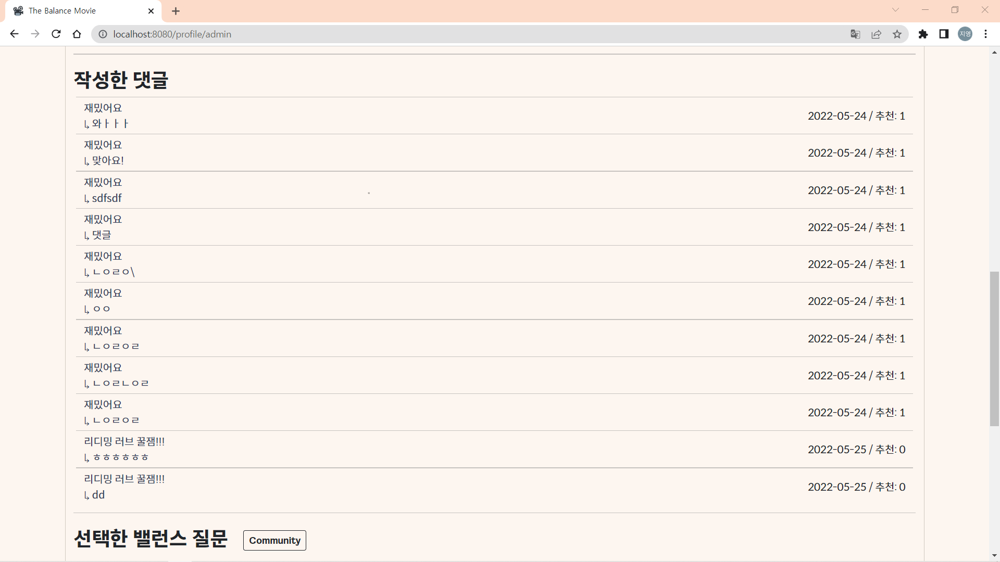

     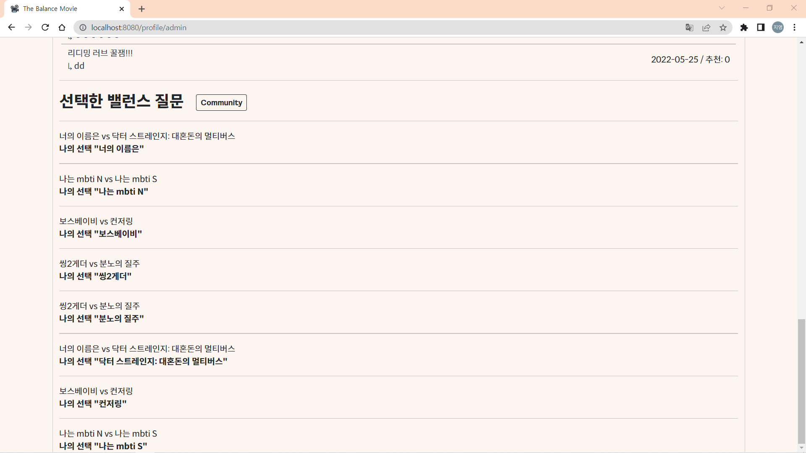

  6. 관리자용 영화 추가 페이지

     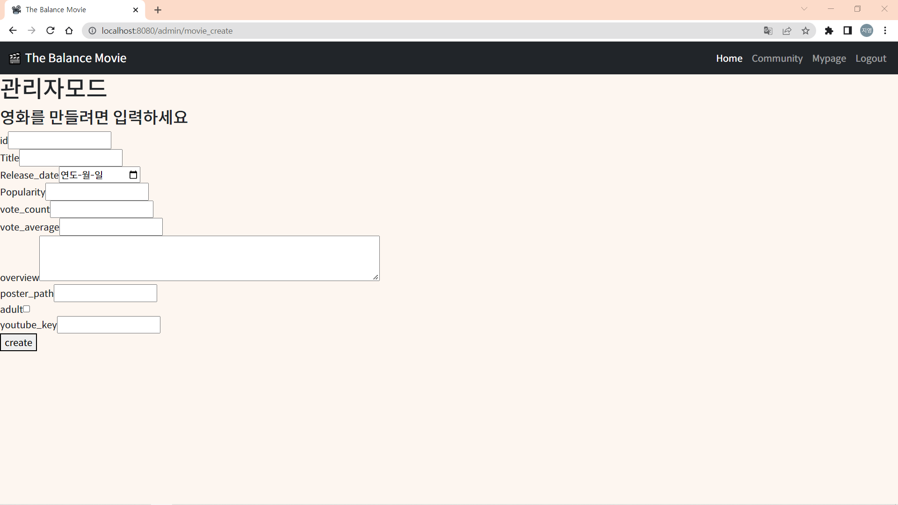
  
- 관리자 모드를 만들다 보니, 또다시 url 과 views 파일의 BACKEND를 건드려야만 했다.. ㅠㅠ 필요한 변수를 통해 잘 작동하게 만들었지만, serializer 할 때 M:N 관계 에서 POST 로 URL을 보내면 read*_only 하지 않고서는 생성할 수 없음을 깨달았다. 사실 이게 지금도 조금 헷갈리는 부분이다. MTM 자체에서 알아서 중계테이블을 만들어 주는 것으로 알고 있는데 이것을 실제로 POST 에 Key와 Value를 넣고 만들 수 없는 건지 아직도 의문이라 질문이 필요한 것 같다. 객체가 들어가야 하는데 value 값으로 보내지지 않아서 의문이다.

##### 5월 26일 [css 및 마무리 단계]

- 해야할 일: 

  - Login, Signup, 관리자 페이지 css
  - css 마무리 작업

- 한 일: 

  - router 이동을 할 때 이전의 스크롤 위치가 그대로 유지되는 현상이 있었다. vue 공식문서에서 이와 관련한 스크롤 동작에 대한 내용을 확인할 수 있었다. 이 기능은 HTML5 히스토리 모드에서만 작동 가능하다.

    ```js
    export const router = new VueRouter({
      mode: "history",
      scrollBehavior() { 
        return { x: 0, y: 0 } 
      },
      routes
     )}
    ```

  - 밸런스 게임이라는 사이트 컨셉에 맞게 페이지의 컨셉 및 분위기를 귀엽게 가기로 결정하여 css를 대폭 수정하였다.

  - 메인 페이지와 커뮤니티 페이지에 헤더를 추가하여 사이트의 기능을 홍보 및 안내하는 문구를 작성하였다.
  
  1. 메인페이지 폰트 수정 / 카드 색 변경 / 헤더 추가
  
     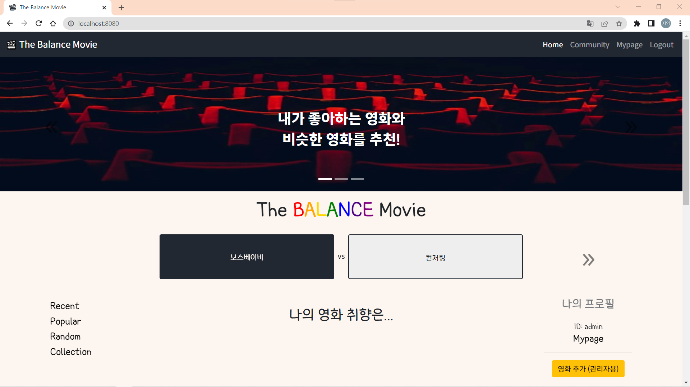
  
  2. 커뮤니티 페이지 헤더 추가
  
     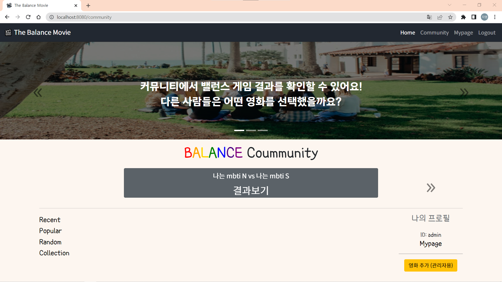
  
     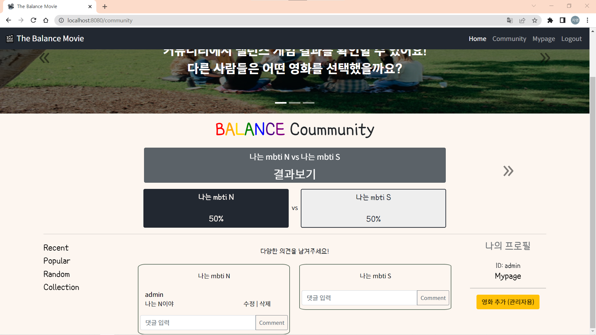
  
  3. 관리자용 페이지 css 작성
  
     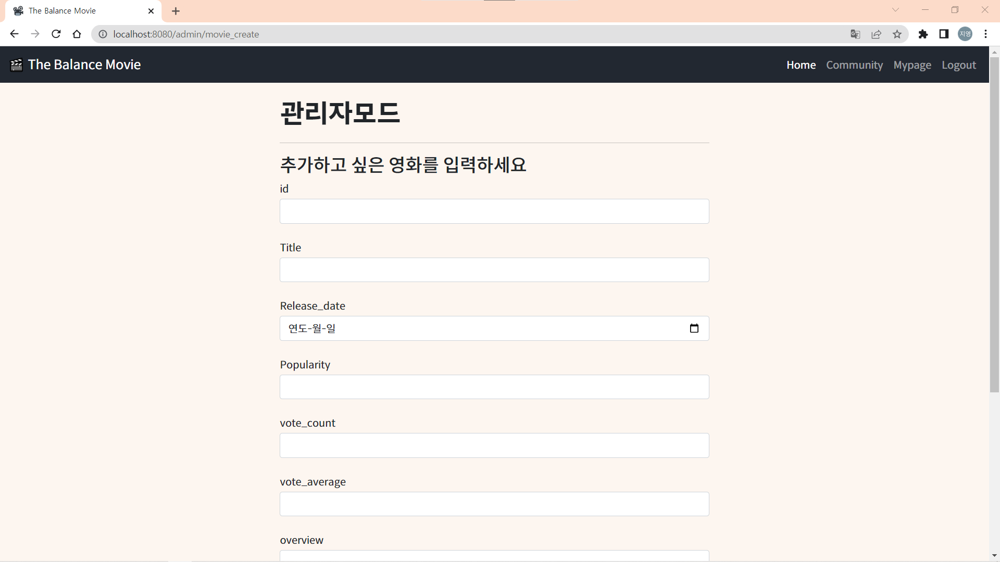
  
  4. 회원가입 페이지
  
     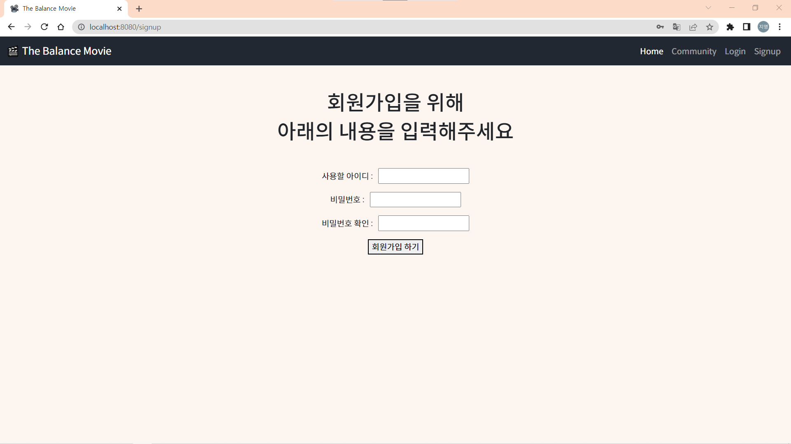
  
  5. 로그인 페이지
  
     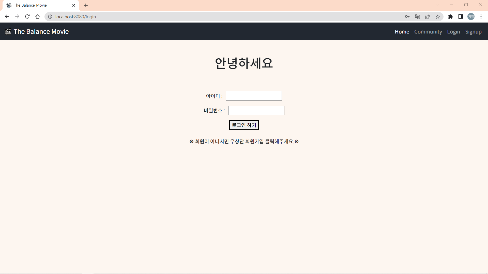

### 마치며..

동희

- 이번 프로젝트 진행에 앞서 우선 계획을 너무 잘 세운것 같다. 계획대로 마무리할 때까지 집중했고, 그 결과 매일 12시, 1시 안에 모두 해결할 수 있었던 것 같다. 이번에도 역시 느낀 것은 맨땅에 헤딩이 많이 성장시켜 주는 길이라는 것을 깨달았다. 파이썬은 이제 너무 친숙해서 좋고, 자바스크립트나 뷰, CSS 도 동작 원리를 알고 에러를 해석할 수 있을 정도는 된 것 같다. 그리고 아직도 고민중인 백엔드, 프론트엔드 진로의 길인데 2학기 때 더 다양한 경험을 하고 정해도 늦지 않다고 생각한다. 이번에 백엔드도 많이 해보고 프론트도 많이 해보면서 느낀 점은 이 둘이 아주 긴밀하게 연관되어 있다고 볼 수 있었고, 데이터를 주고 받는 과정에서 SQL이나, ORM 등 도 꾸준히 공부해야 할 점이라는 것을 느꼈다. 사실, 비슷한 코드를 계속 하다보니, 디테일하게 몰랐던 부분들을 계속 잡아나갈 수 있었고 꽤나 프로그래밍 언어들과 친해진 것을 느꼈다 ㅎㅎ 컴퓨터 학과 전공도 아닌데 이정도로 할 줄 몰랐으나, 배우니까 또 다 되는게 신기했다. 
- 마지막으로 1학기 마지막 페어로 저와 합을 맞춘 김지영님께 감사의 인사를 드리고~ 너무 잘 맞았던 것 같고~ 그만큼 결과도 좋았으면 좋겠고~ 라는 생각이다 ! 길면 길었고, 짧으면 짧았던  SSAFY 1학기 끝.!

지영

- 이번 프로젝트에서 1학기 동안 싸피에서 배운 파이썬, 알고리즘, 장고, 뷰 등등 모든 것을 활용할 수 있었다. 하루동안 진행했던 그동안의 관통 프로젝트와는 달리 일주일이라는 훨씬 긴 시간이 주어졌기 때문에 처음에는 넣고 싶은 기능도 많고 사이트를 예쁘게 꾸미고싶은 욕심도 많았다. 하지만 막상 프로젝트 기간에 들어가니 원하는 사이트를 구현하기에 일주일은 너무나 짧은 시간이었다. 일단 기획을 하는 것이 생각보다 엄청 중요하고 오래걸리는 작업이라는 것을 배울 수 있었다. 우리 조는 처음부터 '밸런스 게임'이라는 컨셉을 빨리 정해서 확실히 밀고 나갈 수 있었는데 데이터베이스를 모델링하고, 사이트 와이어 프레임을 설계하는 것이 생각보다 어려웠다. 또, 모델링을 확실히 했다고 생각했지만 백엔드 코드를 작성하다보면 초기 모델링을 잘못 생각하여 수정이 필요한 경우도 종종 있었다. 우리 조는 거의 모든 코드 작성을 기존 관통프로젝트에서 했던 것처럼 번갈아가면서 네비게이터와 드라이버를 맡아 함께 하였다. 이러한 작업 방식을 선택한 이유는 아직은 백엔드와 프론트엔드가 둘다 익숙하지 않기 때문에 함께 코드를 작성하는 것이 서로에게 도움이 될 것이라고 생각했기 때문이다. 이렇게 코드를 짜면서 가끔은 생각이 다를 때가 있었는데 어떤 방식으로 짜든 틀린 코드는 없다는 것을 배울 수 있었다. 이번 프로젝트를 통해 웹사이트가 어떻게 동작하는지 전체적인 흐름을 이해하게 되었고, 코딩에 흥미를 좀 더 가지게 된 것 같다. css에 있어서는 아직 다른 사이트들을 보면서 많이 배워야겠다고 생각하였다. 
- 페어와 함께 하니 혼자서는 하기 싫었던 작업들도 같이 재밌게 할 수 있었던 것 같다. 동희님과 생각하는 것이나 패턴 등이 잘 맞아서 같이 페어하게 된 것이 다행이라는 생각이 들었다. 덕분에 재미있게 큰 어려움이나 힘든 일 없이 프로젝트를 잘 끝낸 것 같아 감사의 인사를 드리고 싶다.


#### PS : 추가하고 싶은 기능

```
더 많은 속성값들의 질문을 통해 원하는 movie를 추천해주는 기능.

처음에 작성한 질문지 :
1. 어른이 vs 애어른. (나이제한)  adult
2. 현재에서 살기 vs 과거로 가기 (개봉일) (수정됨) release_date
3. 꽃피는 봄날 3,4월 vs 가을바람 9,10월 (개봉일) release_date
4. 보스베이비 vs 컨저링 (애니메이션 vs 공포) genre
5. 너의 이름은 vs 닥터스트레인지(로맨스 vs 액션) genre
6. 씽2게더 vs 분노의 질주(뮤지컬 vs 범죄) genre
7. 요즘사람 (현대) vs 옛날사람 (사극) genre
8. mbti n vs s (로맨스 vs sf) genre
9. 송강호 vs 황정민 (주연배우)  lead_actor
10. 전지현 vs 손예진 (주연배우) lead_actor
11. 외국영화 vs 국내영화 (언어)  detail_production_countries
12. 리버풀(스페인) vs 레알 마드리드(영국) detail_production_countries X
13. 겨울왕국 vs 토이스토리 (디즈니 vs 픽사) company
14. 아이언맨 vs 슈퍼맨 (마블 vs 디씨) company
15. 나는 긴 영화가 좋아 vs 난 짧은 영화가 좋아 runtime X
16. 어쩔티비 vs 저쩔터비 (아무거나 1) 그냥 random
17. 우짤래미 vs 저짤래미(아무거나 2) 그냥 random

질문지를 사용하기 위해서 아래와 같이 데이터 전처리 후 진행해야 함.
어른이 vs 애어른: adult
현재에서 살기 vs 과거로 가기: release_date
꽃피는 봄날 3, 4월 vs 가을바람 9,10월: release_date
보스베이비 vs 컨저링: genre
```


#### 기타 : 

```
json dumpdata저장

`python -Xutf8 manage.py dumpdata community --indent 4 > ./community/fixtures/community.json `

data load

`python manage.py loaddata community.json`
```


